# Vityo System Architecture

**Purpose:** Define Vityo's maintained system boundaries, application composition, language/runtime adapters, and source-authoritative Flow Hero target. Product commitments remain in [Vityo-Product-Spec.md](./Vityo-Product-Spec.md).

**Last updated:** 2026-10-03

**Status:** Current system architecture

## 1. 总体架构

Vityo is the agent-native IDE for Styio. Its core is a complete IDE that operates without an Agent.
The Flutter/Dart client, the selected Rust Vityo Coding Agent executable, and the existing Rust
`vityod` local daemon have independent process lifecycles. The local daemon supervises compatible
Agent processes and owns durable desktop workspace/process services. Agents use the same advertised
operations and user authorization; they do not control Flutter widgets.

<!-- VITYO_ARCHITECTURE:START -->
Generated from [`system-architecture.json`](./architecture-views/system-architecture.json).

```mermaid
flowchart LR
  subgraph agents["Agent processes"]
    direction TB
    rust_agent["Rust Coding Agent · CURRENT"]
    compatible_agents["Compatible Agents · TARGET"]
  end
  subgraph protocol["Protocol and local daemon"]
    direction TB
    agent_protocol["ACP v1 + Vityo proposal extension · CURRENT"]
    acp_operations_gateway["ACP operations gateway · CURRENT"]
    vityod["vityod daemon · CURRENT"]
  end
  subgraph client["Flutter IDE"]
    direction TB
    workbench_projection["Workbench projection · CURRENT"]
    flutter_ide["Flutter IDE · CURRENT"]
    local_daemon_client["vityod client · CURRENT"]
    neutral_operation_dispatcher["IDE operation dispatcher · CURRENT"]
    flow_hero_buffers["Flow Hero path-bound buffer · CURRENT"]
    flow_hero["Flow Hero live file route · CURRENT"]
  end
  subgraph authorities["Language and project authorities"]
    direction TB
    styio["Styio language service · CURRENT"]
    flow_semantics_gap["Styio graph / rewire · GAP"]
    pafio["Pafio project metadata · CURRENT"]
  end
  subgraph delivery["Build and verification"]
    direction TB
    python_delivery["Python delivery pipeline · CURRENT"]
    quality_engines["Test and package engines · CURRENT"]
  end
  flutter_ide -->|"route typed local requests"| local_daemon_client
  local_daemon_client -->|"local daemon IPC"| vityod
  vityod -->|"workspace and process facts"| workbench_projection
  workbench_projection -->|"ordered state and event projection"| flutter_ide
  rust_agent -->|"independent ACP session"| agent_protocol
  compatible_agents -->|"same authorized capabilities · TARGET"| agent_protocol
  agent_protocol -->|"negotiated file and terminal operations"| acp_operations_gateway
  acp_operations_gateway -->|"session poll and correlated result"| neutral_operation_dispatcher
  neutral_operation_dispatcher -->|"read or edit the active path-bound file"| flow_hero_buffers
  flow_hero_buffers -->|"live path-bound source and proposal projection"| flow_hero
  neutral_operation_dispatcher -->|"workspace CAS transaction and PTY"| vityod
  rust_agent -->|"revision-bound proposal; IDE reviews and commits"| flutter_ide
  flutter_ide -->|"analyze current document revision"| styio
  styio -->|"typed flow and supported rewrites · GAP"| flow_semantics_gap
  pafio -->|"project/package/target metadata"| flutter_ide
  python_delivery -->|"run deterministic validation"| quality_engines
  quality_engines -->|"deterministic product checks"| flutter_ide
  quality_engines -->|"deterministic Agent/protocol fixtures"| rust_agent
```


<!-- VITYO_ARCHITECTURE:END -->

The IDE owns source buffers, document and workspace revisions, Styio compiler/runtime facts, and
workspace transactions. Agent runtimes own model/provider access, context selection, the tool loop,
Agent policy, durable sessions, and multi-Agent orchestration.

## 1.1 Product And Repository Ownership

The repository has three product-facing roots and one separate local service process:

| Root | Ownership |
|---|---|
| `products/vityo_app/` | Flutter IDE, editor and workspace state, language/runtime adapters, Agent Client and IDE-side review/transaction policy, and presentation. |
| `products/vityo_coding_agent/` | First-party Agent product. Its independent Rust executable composes the ReAct loop, OpenAI-compatible streaming provider, authorized ACP tools, proposal protocol, and durable session/effect journal. `--stdio-agent` is its GUI-independent control surface; a separate headless CLI is not required. |
| `packages/vityo_agent_protocol/` | Versioned, implementation-independent IDE-to-Agent wire contract. |

`products/vityo_app/native/vityod/` is the separately executable Rust daemon for local workspace and
process services. It is not the Coding Agent and is not an in-process Flutter bridge.

Within the Flutter application, responsibilities follow the actual source roots:

1. `lib/src/app/` is the composition root. It creates and injects shared IDE services into the application presentation.
2. `lib/src/view_ide/` owns presentation-independent IDE services and contracts, including language, runtime, platform, and backend-toolchain adapters. `backend_toolchain/` is an active implementation root for those adapters; it is not a legacy export façade.
3. `lib/src/ide/` owns editor, document/workspace, Agent Client, and collaboration application state. A consumer uses an explicitly registered public contract or projection from its owner rather than relocating that domain to satisfy an import rule.
4. `lib/src/view_render/` owns Flutter screens and visual state bindings. It consumes only explicitly registered public contract/projection surfaces from their actual owners.
5. `lib/src/frontend_shell/` aggregates the public Flutter shell entry points; it is not a replacement for `app/` composition.
6. The old top-level `backend_toolchain/`, `editor/`, `language/`, and `integration/` import roots are retired. Do not restore compatibility exports under those paths.
7. `prototype/` is a permanent source asset and remains alongside the Flutter product.

The words *frontend* and *backend* describe deployment or user-facing responsibilities, not a reason to duplicate semantic authority. Vityo owns client-side editing and orchestration contracts. Styio owns language/compiler semantics, and Pafio owns project/package metadata. Hosted services own their published remote facts. Flutter code must not infer those facts from page state or private upstream storage.

## 1.2 IDE Implementation Boundary

The Flutter application keeps these ownership layers distinct:

1. `lib/src/view_ide/` owns presentation-independent service contracts, adapters, capability models, environment services, module/runtime models, and application services in those domains. It must not import Flutter presentation libraries or `view_render/`.
2. `lib/src/ide/` owns editor/document/workspace application state and Agent Client/collaboration state. Its owner paths remain separate from `view_ide/` where the implementation ownership differs.
3. `lib/src/view_render/` owns Flutter widgets, screens, visual state, themes, and presentation bindings. It may consume only the public model/adapter/projection paths recorded in the path-level boundary registry, regardless of whether each path is owned by `ide/` or `view_ide/`.
4. `lib/src/app/` is the composition root. It creates shared service instances and injects them into the shell/presentation; widgets do not construct competing workspace or Agent authorities.

The `view_ide/`, `ide/`, and `view_render/` roots have distinct owners. A path-level allowlist in the architecture boundary gate records the small set of public model, adapter, and projection surfaces that presentation may consume. This does not make the remaining implementation directories public APIs.

本边界由以下命令守住：

```bash
python3 scripts/check_architecture_boundaries.py
python3 scripts/import-boundary-gate.py
```

## 1.3 Application Composition And Current Flow Hero Entry

`AppBootstrap.load()` and `VityoApp` are reusable composition surfaces, but the current
`products/vityo_app/lib/main.dart` passes `const FlowHeroApp()` to the desktop startup probe; the
normal launch still uses Flow Hero directly and does not load `AppBootstrap` or construct
`VityoApp`. Flow Hero's `WorkbenchController` owns built-in demonstration buffers and can open
path-bound `BufferFile` values. Those local buffer and file paths do not by themselves establish
the shared daemon document revision and transaction authority; in particular, pathless demo
buffers are not workspace resources.

Flow Hero still renders a sample graph from a restricted parser and uses demonstration runtime
presentation. Its graph is not Styio semantic truth. For an explicitly configured workspace, the
selected client launches the packaged Rust Agent through vityod, and `FlowHeroAgentOperationPort`
routes standard ACP filesystem/terminal operations through the real path-bound `WorkbenchController`
buffer, workspace document read/atomic transaction service, and vityod PTY. Revision-bound source
proposals receive a correlated Apply/Reject decision. Pathless demonstration buffers remain
unavailable. These operation paths do not make the canvas a semantic graph editor.

The standard Agent-neutral process and operation route is implemented and has a fresh-binary
initialize/session process check. The remaining Flow Hero feature milestone is full source/dock
synchronization and Styio-backed graph semantics, supported rewires, and runtime mapping. The route
must converge on canonical document, transaction, and Styio semantic owners; it must not make the
canvas a second program store. Capability negotiation alone does not prove untested behavior.

## 1.4 Source Of Language And Project Truth

Styio owns source grammar, parsing, type and resource rules, semantic flow facts, valid source rewrites, compiler results, and execution semantics. Pafio owns workspace/package/dependency/target metadata. Vityo renders typed, revisioned facts and applies proposed edits through IDE-owned document transactions. Generic canvas packages provide interaction and drawing mechanics only; they cannot supply Styio meaning.

## 2. 主要层次

### 2.1 Flutter UI Runtime

负责：

1. 窗口、页面、动画、手势和多平台壳
2. 编辑器渲染层
3. 底部运行视图、Agent Workbench、主题编辑器

不负责：

1. 语言语义裁决
2. 编译器核心逻辑
3. 项目图和包管理状态的推断

### 2.2 Module Host Runtime

负责：

1. core module 与 optional module 的装载关系
2. module manifest 与 capability matrix
3. staged update
4. 安装、卸载、禁用、重启后激活的生命周期
5. 平台化的数据回收与入口回收策略

关键原则：

1. 当前会话中的已挂载模块保持稳定。
2. 待更新的 module package 只进入 staged 状态，重启后激活。
3. iOS 不挂载本地编译模块。
4. module manifest 安全检查归 `view_ide/module_host/module_manifest_security.dart`，manifest 在 activation 前必须完成 schema、permission 和 capability 信任校验。

### 2.3 Custom Editor Engine

负责：

1. 文档模型
2. 光标与选择
3. 输入法与键盘映射
4. 行布局、块布局、overlay、装饰层
5. visual substitution 和 semantic block surface

关键原则：

1. Source Buffer 与显示层严格分离。
2. glyph substitution 由装饰层完成，不写回原文。
3. 结构装饰由语言服务驱动。
4. substitution 状态属于配置层，不改变底层文档模型。

### 2.4 Product-Owned Adapter Layer

`Vityo` 主线只依赖以下四个合同：

1. `LanguageServiceAdapter`
2. `ProjectGraphAdapter`
3. `ExecutionAdapter`
4. `RuntimeEventAdapter`

每个合同允许三种实现形态：

1. `CLI Adapter`
2. `FFI Adapter`
3. `Cloud Adapter`

关键原则：

1. `Vityo` 拥有产品合同，上游来适配。
2. Flutter 主线不依赖上游内部源码结构、类名或某个专门命名的 native 包。
3. 缺能力时，adapter 返回 capability gap，不让 UI 崩溃或猜状态。
4. `DependencySourceAdapter` 与 `DeploymentAdapter` 属于后端工作流面；compiler 状态由 Styio machine contract 直接提供，不能回流进 UI 层自行推断。

平台后端由 `BackendProviderRegistry` 统一装配：

1. 每个平台拥有独立的 `BackendProvider` 入口，负责创建该平台的 project metadata、execution、runtime event、dependency 与 deployment adapters。
2. `AppBootstrap` 只解析一次当前平台 Provider，不再直接调用各 Adapter 的全局平台工厂。
3. Provider 注册以稳定 `id`、支持平台集合和优先级为选择合同；同平台同优先级冲突、重复 `id` 或缺少 Provider 都必须 fail closed。
4. 默认 Provider 位于 `products/vityo_app/lib/src/view_ide/backend_toolchain/providers/`；平台专项实现可以通过注入 `BackendProviderRegistry` 独立开发和测试，不需要修改 `AppBootstrap`。
5. Web 构建只注册 hosted Web Provider；IO 构建分别注册 Windows、Linux、macOS、Android、iOS 和 unknown fallback Provider，禁止在 IO 测试中伪装 Web 后端。

### 2.5 Language Workspace Service

负责：

1. 把当前文档和工作区提交给 `LanguageServiceAdapter`
2. 组织 token、semantic span、diagnostic、quick fix、formatting、completion、hover
3. 把结果回流到编辑器渲染层和 inspector

关键原则：

1. 基础高亮先消费 `TokenSpan`，再叠加 `SemanticSpan`。
2. diagnostics 与 quick fix 属于独立层，不负责基础高亮。
3. 格式化返回补丁，不直接改写 Source Buffer。
4. 合同结构借鉴 LSP，但实现自研。

正式合同见：

1. [../contracts/LanguageServiceAdapter.md](../contracts/LanguageServiceAdapter.md)

### 2.6 Project Graph Service

负责：

1. 读取 Pafio metadata、Styio machine-info 或 Platform hosted payload
2. 暴露 workspace graph、targets、toolchain、lock/vendor/build 状态
3. 驱动左侧工程树、target selector 和 toolchain badge

关键原则：

1. `Vityo` 不通过私有目录结构推断业务状态。
2. `pafio.toml` 仅用于识别本地项目；package facts必须来自 `pafio metadata --json`。
3. compiler 与 hosted workspace 分别来自 Styio machine contract 和 Platform hosted API。

正式合同见：

1. [../contracts/ProjectGraphAdapter.md](../contracts/ProjectGraphAdapter.md)

### 2.7 Execution Service

负责：

1. 保存后编译、显式运行和状态回流
2. compile/run session 管理
3. stdout / stderr / diagnostic 日志回流

关键原则：

1. scratch file 路径与项目路径可以不同实现，但都落到同一 `ExecutionSession` 合同上。
2. 当前未发布的执行路径必须明确返回 `blocked`。
3. iOS 主线只走 cloud execution。
4. 本地执行路径必须通过 `view_ide/environment/execution/execution_sandbox.dart` 做 argv、权限、timeout、workspace 和 redaction 约束。

正式合同见：

1. [../contracts/ExecutionAdapter.md](../contracts/ExecutionAdapter.md)

### 2.8 Runtime Event Service

负责：

1. 统一 runtime 事件 envelope
2. 驱动 thread lanes、状态机图、debug console
3. 保证未知事件只降级，不崩溃

正式合同见：

1. [../contracts/RuntimeEventAdapter.md](../contracts/RuntimeEventAdapter.md)
2. [../contracts/AdapterCapabilitySnapshot.md](../contracts/AdapterCapabilitySnapshot.md)

### 2.9 Agent Client, Workbench, And Security Boundary

Vityo is an open Agent Client, not a model host:

1. `ide/agent_client/` owns process supervision, protocol connectivity, capability projection,
   correlated sessions and permissions, and bounded MCP/context export.
2. `ide/workbench/agent_collaboration/` owns immutable task, permission, proposal, and transaction
   projection; `presentation/agent_workbench/` owns task, plan, permission, change-preview, and
   verification receipt presentation. `Agent Panel` may remain the name of one view inside this
   workbench.
3. `products/vityo_coding_agent/` or another compatible Agent owns provider credentials,
   model/provider routing, context selection, the ReAct action/observation loop, Agent policy,
   durable sessions, and multi-Agent scheduling. A concise task plan is optional state inside that
   loop; the IDE does not schedule subagents.
4. Standard ACP filesystem and terminal requests are routed through the same advertised,
   authorized IDE operations. Source-aware atomic proposals use the existing revision-bound Vityo
   extension and IDE transaction review; neither Agent receives direct file authority.
5. The frontend renders authoritative document/workspace revisions, actual operation/session
   events, results, proposals, and transaction receipts. Raw hidden reasoning is not a UI event.
6. Vityo's edit, analyze, test, run, and observe paths remain available when no Agent is connected.

Execution sandboxing, IDE secret storage, log redaction, and module trust remain IDE concerns for
IDE-owned operations. Agent-runtime secrets and tool policy remain Agent-runtime concerns. Protocol
messages and all UI projections must be redacted and must never contain raw credentials.

These IDE-owned components exist as reusable application and presentation surfaces. The vityod
Agent host owns ACP processes and permission requests; standard ACP filesystem/terminal routing
through the real Flow Hero buffers and vityod workspace/PTY owners is implemented and covered by
deterministic integration tests. The Rust Agent process descriptor is selected only when the user
has explicitly supplied a nonempty `VITYO_WORKSPACE`. Nonempty ACP `mcpServers` attachments remain
unavailable and are explicitly rejected by the Rust Agent; migrated library modules do not imply a
production attachment lifecycle. See
[Vityo-Implementation-Gaps.md](./Vityo-Implementation-Gaps.md) and
[ADR-0022](../adr/ADR-0022-agent-neutral-operation-boundary.md) for the selected boundary and gaps.

### 2.10 Source-Authoritative Flow Hero

Flow Hero remains an editor view over the shared Styio document. It does not own another program model.

1. **One source authority.** The editor's document/workspace services own text, document revisions, history, and persistence. The lower-right source dock edits the actual selected document or a range anchored into it; it never keeps a copied snippet as a second saveable source.
2. **Derived graph.** Styio language-service facts for a document revision determine operation/resource nodes, typed input/output ports, source ranges, diagnostics, and directed semantic edges in producer-to-consumer order. The graph is a keyed projection/cache. Pafio project metadata does not define program flow. A stale or incomplete analysis must remain identified as stale/incomplete; a canvas gesture cannot invent valid language semantics.
3. **Separate layout state.** Moving a node changes view/layout state only. Positions, selection, zoom, and palette are presentation state and do not rewrite source or alter semantic edges.
4. **Source rewiring.** A connection gesture is a transient preview. A semantic rewire request is sent to the Styio-owned language service with the expected document revision and the edge/endpoint identity. The current committed edge remains until an accepted source edit is applied. Cancellation or rejection leaves source and graph unchanged. An accepted edit is checked against its base revision, applied once through the IDE workspace/editor transaction path, and then reanalyzed. Async validation must not be hidden inside a graph library's synchronous hover/completion predicate.
5. **Code and Agent edits.** Typing in the dock, full editor changes, and accepted Agent proposals enter the same document revision/analyze/projection path. Agent updates first remain proposals governed by protocol permissions and IDE review; animation may reflect an observed proposal or committed edit only when its state is labelled accurately.
6. **Execution is a separate state.** Run effects are driven only by ordered runtime evidence for an execution and source revision. A graph overlay requires a source/semantic identity supplied by the owner. Replay and live stream must be distinguished; editing transitions are not runtime pulses.
7. **Incremental rendering.** Preserve stable semantic identities, update only affected keyed nodes/edges, preserve manual positions, and animate those real projection deltas. Arrange the graph only at explicit/initial layout boundaries; do not relayout the whole graph on each keystroke. Preserve reduced-motion preferences and the Flow Hero visual baseline.

The path-bound file and Agent proposal operation route is current; the full source dock/full editor convergence, semantic graph, source rewrites, runtime mapping, and view-only graph editing remain target features. The detailed semantic handoff remains owned by [Styio-Language-Service-Adapter-Contract.md](../external/for-styio/Styio-Language-Service-Adapter-Contract.md). Vyuh Node Flow is the current canvas candidate, subject to its reconnection cancellation/lock lifecycle and a visual/interaction parity proof. GraphView is limited to layout coordinates, not a second canvas renderer. Neither is adopted as a production dependency by this architecture/CI foundation. Preserve the independent `prototype/` asset.

## 3. Platform Execution Matrix

| Platform | Primary Project Graph Route | Primary Execution Route | Notes |
|----------|-----------------------------|-------------------------|-------|
| macOS / Windows / Linux | CLI or FFI | CLI first, FFI optional | Desktop route |
| Android | CLI or Cloud | Local-first when supported; hosted route when declared | Platform capability determines route |
| iOS | Cloud | Cloud only | No unrestricted local compiler modules |
| Web | Cloud | Cloud only | Hosted workspace route |

## 4. Current Integration Strategy

1. Consume published Styio machine contracts through product-owned adapters.
2. Keep project/package metadata separate from Styio program semantics.
3. Use CLI or FFI as implementation choices behind the same typed product contracts.
4. When an upstream machine contract changes, update its adapter and deterministic contract coverage without moving upstream semantics into Flutter UI.

## 5. Current Code Anchors

The following implementation roots exist in the current checkout:

1. `products/vityo_app/lib/main.dart` — current Flutter package entry; the normal path still starts the Flow Hero route directly, with a separate first-frame delivery probe.
2. `products/vityo_app/lib/src/app/app_bootstrap.dart` and `vityo_app.dart` — reusable service composition and shell application.
3. `products/vityo_app/lib/src/ide/editor/` and `ide/workspace/` — source/editor and workspace application state.
4. `products/vityo_app/lib/src/ide/agent_client/` and `ide/workbench/agent_collaboration/` — Agent protocol client and IDE-owned collaboration projection/transactions.
5. `products/vityo_app/lib/src/view_ide/backend_toolchain/` and `view_ide/language/` — active backend/toolchain and language adapter/service implementations.
6. `products/vityo_app/lib/src/view_render/` — Flutter presentation, including current isolated `flow_hero/` and the reusable IDE shell.
7. `products/vityo_app/native/vityod/` — independent local workspace and process daemon.
8. `products/vityo_coding_agent/` — independent Rust companion executable with composed ReAct/provider/session/ACP runtime; the separate local process and Flow Hero operation join is exercised by deterministic tests.
9. `packages/vityo_agent_protocol/` — shared Agent protocol.

## 6. Architecture Model And Generated Views

The source for the current/target/gap process view is
[`architecture-views/system-architecture.json`](./architecture-views/system-architecture.json).
It generates the Mermaid block above, the standalone HTML view, and the no-fetch HTML fragment
used by the local inline viewer. Keep architecture decisions and semantic requirements in this
document and the linked ADRs; source anchors and import checks keep evidence and dependency
direction current but do not prove runtime behavior.

Regenerate the outputs after changing the model or its owned source facts:

```bash
python3 scripts/vityo_architecture.py --write
```

The selected delivery entry point is `python3 scripts/vityo.py deliver`.
The delivery pipeline invokes `python3 scripts/vityo_architecture.py --check` as its architecture
stage. For review, `python3 scripts/vityo_architecture.py --serve --watch` serves only the page and
model JSON on loopback, refreshes on model changes, and regenerates the checked-in outputs. The
fragment mode is `python3 scripts/vityo_architecture.py --fragment`; it reads the same model without
fetching or making network requests.
